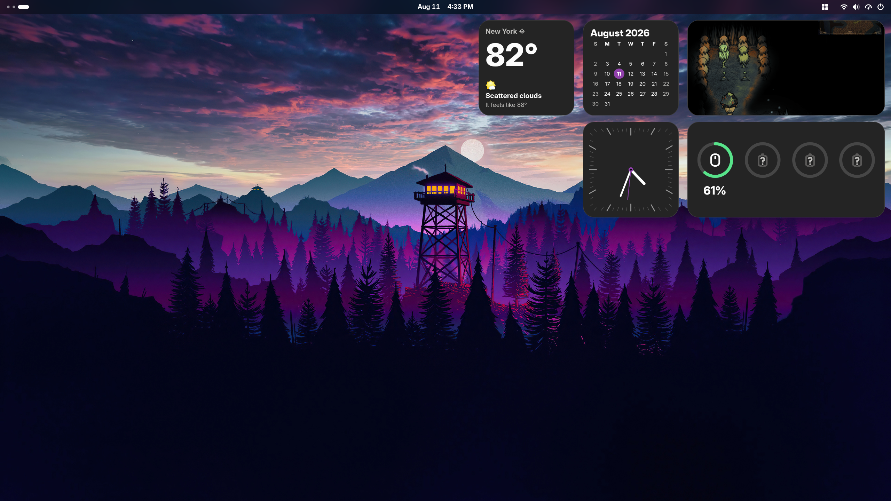

**This GitHub repo (<https://github.com/TheRealSourcer/widgets>) is the official
source for the project. Do not download releases from unverified sources.**

# Widgets (V0.2.2)


This is a GNOME Shell extension that provides gnome-themed widgets to your desktop.



It focuses on:

 - **integration**: easy access in GNOME top panel and incorporation with the GNOME ecosystem.
 - **style**: tightly follows GNOME Shell theme and styling.
 - **freedom**: free, unencumbered software released into the public domain

Its features include:

- **Clock**: an analog clock that updates in real time.
- **Calendar**: a compact monthly calendar with one-click access to GNOME Calendar.
- **Weather**: current conditions, temperature, and feels-like information using your GNOME Weather location.
- **Photos**: a cover-style photo widget that displays pictures from your Camera, Screenshots, and Downloads folders.
- **Battery**: battery levels for the computer and connected Bluetooth devices, with support for up to four devices.

## Prerequisites

1. **GNOME Shell:** Version 50.

## Get the extension

 - **GNOME Extensions Website:** [Download from extensions.gnome.org] *https://extensions.gnome.org/extension/10607/widgets/*
 - **Manual Installation:**
   ```bash
   git clone [https://github.com/TheRealSourcer/widgets.git](https://github.com/TheRealSourcer/widgets.git)
   # Copy the extension folder to your local GNOME extensions directory
   cp -r widgets@distro.com ~/.local/share/gnome-shell/extensions/
   ```
   *Note: Remember to restart GNOME Shell and enable the extension via the "Extensions" app.*

## Resources

 - [GNOME Extensions Guide](https://gjs.guide/extensions/) - For GNOME extension environments.

## Contact

You can open an [issue] for bug reports, feature requests, or general questions regarding the GNOME extension.

[issue]: https://github.com/TheRealSourcer/widgets/issues

## License

    This is free and unencumbered software released into the public domain.
    
    Anyone is free to copy, modify, publish, use, compile, sell, or
    distribute this software, either in source code form or as a compiled
    binary, for any purpose, commercial or non-commercial, and by any
    means.
    
    In jurisdictions that recognize copyright laws, the author or authors
    of this software dedicate any and all copyright interest in the
    software to the public domain. We make this dedication for the benefit
    of the public at large and to the detriment of our heirs and
    successors. We intend this dedication to be an overt act of
    relinquishment in perpetuity of all present and future rights to this
    software under copyright law.
    
    THE SOFTWARE IS PROVIDED "AS IS", WITHOUT WARRANTY OF ANY KIND,
    EXPRESS OR IMPLIED, INCLUDING BUT NOT LIMITED TO THE WARRANTIES OF
    MERCHANTABILITY, FITNESS FOR A PARTICULAR PURPOSE AND NONINFRINGEMENT.
    IN NO EVENT SHALL THE AUTHORS BE LIABLE FOR ANY CLAIM, DAMAGES OR
    OTHER LIABILITY, WHETHER IN AN ACTION OF CONTRACT, TORT OR OTHERWISE,
    ARISING FROM, OUT OF OR IN CONNECTION WITH THE SOFTWARE OR THE USE OR
    OTHER DEALINGS IN THE SOFTWARE.
    
    For more information, please refer to <https://unlicense.org>
